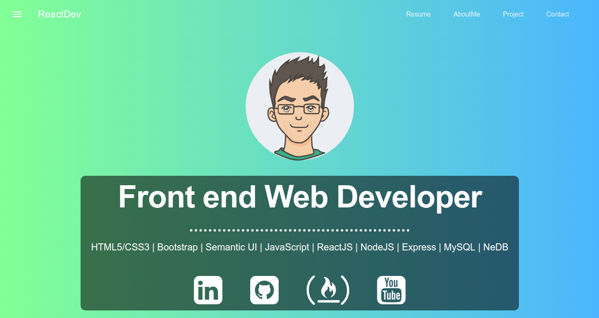

# :rocket: Website ReactJS with MDL (Modern Design Lite)

Simple, Easy, Fastest and Clean Grid .

## Preview

## Development 
1. Clone this repo with `git clone https://github.com/rahmandikahaekal/Site-React-MDL.git`
2. write on your terminal/command-prompt `cd Site-React-MDL`
3. then, install the package node with `npm install`
4. If all done, now we start the react site by write `npm start` or `yarn start`
